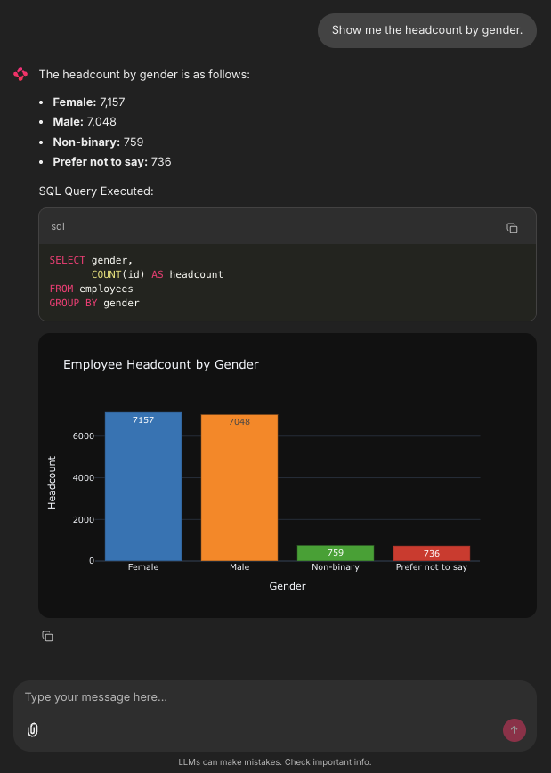

# Agentic AI Workshop

Welcome to the Agentic AI Workshop! This repository contains hands-on Jupyter notebooks demonstrating how to build intelligent AI agents using LangChain, LangGraph, and modern LLMs.



## 🎯 Workshop Overview

This workshop is designed to teach you how to build agentic AI systems through two comprehensive hands-on notebooks:

### 1. **HR Synthetic Database Generator** (`hr_synthetic_database.ipynb`)

Learn how to build an agentic workflow that generates realistic synthetic HR databases based on natural language company descriptions.

**Key Features:**

- Convert user descriptions into structured company specifications using LLMs
- Generate demographic ratios based on company characteristics
- Create complete HR database schema with business units, departments, jobs, and employees
- Parallel processing for efficient data generation
- Automatic compensation calculation and employee education assignment

### 2. **People Analytics Agent** (`people_analytics_agent.ipynb`)

Build an intelligent agent that can query and analyze HR databases using natural language.

**Key Features:**

- Natural language to SQL query translation
- Automatic SQL execution and data retrieval
- Statistical analysis and calculations
- Data visualization with Plotly
- Structured responses with summaries, datasets, and charts

## 🚀 Getting Started

### Option 1: Google Colab (Recommended for Quick Start)

Click on the badges below to open the notebooks directly in Google Colab:

- **HR Synthetic Database Generator**: [](https://colab.research.google.com/github/DougTrajano/agentic-ai-workshop/blob/main/hr_synthetic_database.ipynb)

- **People Analytics Agent**: [](https://colab.research.google.com/github/DougTrajano/agentic-ai-workshop/blob/main/people_analytics_agent.ipynb)

All dependencies will be installed automatically when you run the first cell of each notebook.

### Option 2: Local Installation

#### Prerequisites

- Python 3.12 or higher
- [uv](https://docs.astral.sh/uv/) package manager (recommended) or pip

#### Installation Steps

1. **Clone the repository:**

   ```bash
   git clone https://github.com/dougtrajano/agentic-ai-workshop.git
   cd agentic-ai-workshop
   ```

2. **Install dependencies using uv (recommended):**

   ```bash
   # Install with development dependencies
   uv sync --group dev
   ```

   **Or using pip:**

   ```bash
   # Create virtual environment
   python -m venv .venv
   source .venv/bin/activate  # On Windows: .venv\Scripts\activate
   
   # Install dependencies
   pip install -e ".[dev]"
   ```

3. **Start JupyterLab:**

   ```bash
   # With uv
   uv run jupyter lab
   
   # Or with activated virtual environment
   jupyter lab
   ```

4. **Set up your API keys:**

   Both notebooks require API keys for LLM access (e.g., Google Gemini, OpenAI). You'll be prompted to enter these when running the notebooks, or you can set them as environment variables.

## 📚 What You'll Learn

- **Agentic Workflows**: Build multi-step AI workflows with LangGraph
- **Tool Use**: Create and integrate custom tools for AI agents
- **LLM Integration**: Work with modern LLMs like Google Gemini
- **Database Operations**: Generate and query SQL databases with AI
- **Data Visualization**: Create interactive charts and dashboards
- **Production Patterns**: Implement error handling, streaming, and structured outputs

## 🏗️ Project Structure

```text
├── hr_synthetic_database.ipynb    # Database generation agent notebook
├── people_analytics_agent.ipynb   # People analytics query agent notebook
├── pyproject.toml                # Project dependencies
├── LICENSE                       # Apache 2.0 license
└── README.md                     # This file
```

## 📦 Dependencies

This workshop uses several key libraries for building agentic AI systems. For the complete list of dependencies and their versions, please refer to the [`pyproject.toml`](pyproject.toml) file.

**Main libraries include:**

- **LangChain**, **LangGraph**, **LangChain Community**: Agent orchestration and workflow management
- **Google Generative AI** & **OpenAI**: LLM integration (Gemini and GPT models)
- **Datasets** & **Hugging Face Hub**: Data handling and storage
- **Pandas**, **NumPy**, **Plotly**: Data analysis and visualization
- **SQLAlchemy**, **DuckDB**: Database operations and querying
- **Pydantic**: Data validation and settings management
- **Faker**: Synthetic data generation
- **Chainlit**: Interactive chat interfaces
- **pyngrok**: Tunneling for public access

All dependencies are automatically installed when running the notebooks in Google Colab or when using the local installation methods above.

## 🤝 Contributing

Contributions are welcome! Please feel free to submit a Pull Request. For major changes, please open an issue first to discuss what you would like to change.

## 📄 License

This project is licensed under the Apache License 2.0 - see the [LICENSE](LICENSE) file for details.

## 🔗 Links

- [Repository](https://github.com/dougtrajano/agentic-ai-workshop)
- [Issues](https://github.com/dougtrajano/agentic-ai-workshop/issues)
- [Releases](https://github.com/DougTrajano/agentic-ai-workshop/releases)

## 💡 Support

If you have questions or run into issues:

1. Check the notebook documentation and comments
2. Review the [Issues](https://github.com/dougtrajano/agentic-ai-workshop/issues) page
3. Open a new issue with detailed information about your problem

---

**Happy Learning! 🚀**

Built with ❤️ by ADP Brazil Labs
