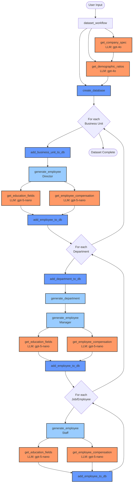

# AI Agents vs. AI Workflows

Uma distinção fundamental na Agentic AI é entre **workflows** e **agents**.

Embora ambos utilizem LLMs como base, eles funcionam de maneiras muito diferentes e servem a propósitos distintos.[^1][^2][^3][^4]

///Caption
[Workflows & agents - LangGraph Documentation](https://langchain-ai.github.io/langgraph/tutorials/workflows/)
///

## Workflows

**Workflows** são sistemas com fluxo de execução **predefinido e determinístico**. O LLM é usado em pontos específicos para tarefas bem definidas, mas o caminho geral de execução é conhecido antecipadamente.

**Características:**

- Fluxo de controle explícito e previsível
- Menor complexidade de implementação e depuração (debug)
- Mais confiáveis e fáceis de testar (fluxos restritos)
- Ideal para processos bem estruturados com etapas conhecidas

**Exemplo:** A geração de um dataset de RH sintético com base em etapas predefinidas. :sunglasses:

## Agents

**Agentes** são sistemas **autônomos** onde o LLM decide dinamicamente quais ações tomar e em que ordem, baseado no **contexto (ambiente)** e nos **objetivos**.

**Características:**

- Tomada de decisão autônoma e adaptativa
- Capacidade de lidar com situações imprevistas
- Maior complexidade de implementação
- Podem ser menos previsíveis

**Exemplo:** Um assistente de análise de dados que:

1. Recebe uma pergunta do usuário
2. Decide autonomamente quais ferramentas usar (SQL, Python, visualização)
3. Ajusta sua estratégia baseado nos resultados intermediários
4. Iterativamente refina a resposta até atingir o objetivo

## Quando Usar Cada Um?

| Critério | Workflow | Agent |
|----------|----------|-------|
| **Processo** | Bem definido e estruturado | Aberto e exploratório |
| **Previsibilidade** | Alta (mesma sequência de passos) | Baixa (decisões dinâmicas) |
| **Complexidade** | Menor | Maior |
| **Manutenção** | Mais fácil | Mais desafiadora |
| **Casos de uso** | Pipelines de dados, automações, fluxos definidos | Tarefas complexas, objetivos dinâmicos |

## Máquina de estados finita

Ambos são frequentemente implementados como [**máquinas de estados finitas (FSM - Finite State Machines)**](https://pt.wikipedia.org/wiki/M%C3%A1quina_de_estados_finita), onde o sistema transita entre diferentes estados com base em entradas e condições definidas. A diferença está na rigidez do fluxo de controle: workflows têm transições fixas, enquanto agentes podem ter transições mais flexíveis e condicionais.

!!! tip "Combinando Workflows e Agentes"
    Na prática, muitos sistemas combinam ambas as abordagens: workflows para estruturar o processo geral e agentes para tarefas específicas que requerem autonomia.[^3]

---

[^1]: [Building Effective AI Agents - Anthropic](https://www.anthropic.com/engineering/building-effective-agents)
[^2]: [Introduction to generative AI apps on Databricks - Databricks on AWS](https://docs.databricks.com/aws/en/generative-ai/guide/introduction-generative-ai-apps)
[^3]: [Workflows & agents - LangGraph Documentation](https://langchain-ai.github.io/langgraph/tutorials/workflows/)
[^4]: [Agents vs. Workflows - Hugging Face Blog](https://huggingface.co/blog/VirtualOasis/agents-vs-workflows-en)
