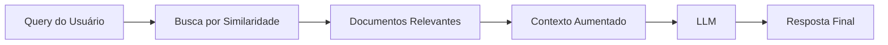

# 🔍 RAG (Retrieval-Augmented Generation)

O **RAG** é uma técnica que permite aos LLMs consultar bases de conhecimento externas antes de gerar respostas, mantendo a informação atualizada e relevante[^14].

## Como Funciona o RAG

1. **Indexação**: Documentos são processados e armazenados como embeddings
2. **Recuperação**: Para uma query, documentos relevantes são encontrados
3. **Augmentação**: O contexto recuperado é adicionado ao prompt
4. **Geração**: O LLM gera resposta com base no contexto aumentado



## Implementação Básica de RAG

```python
from sentence_transformers import SentenceTransformer
import faiss
import numpy as np

class RAGSystem:
    def __init__(self):
        self.encoder = SentenceTransformer('all-MiniLM-L6-v2')
        self.index = None
        self.documents = []
    
    def index_documents(self, docs):
        # Gera embeddings dos documentos
        embeddings = self.encoder.encode(docs)
        
        # Cria índice FAISS
        self.index = faiss.IndexFlatIP(embeddings.shape[1])
        self.index.add(embeddings.astype('float32'))
        self.documents = docs
    
    def retrieve(self, query, k=3):
        # Busca documentos relevantes
        query_embedding = self.encoder.encode([query])
        scores, indices = self.index.search(
            query_embedding.astype('float32'), k
        )
        
        return [self.documents[i] for i in indices[0]]
```

## Estratégias Avançadas de RAG

### 1. Chunking Inteligente

```python
import re
from typing import List

class IntelligentChunker:
    def __init__(self, chunk_size=500, overlap=50):
        self.chunk_size = chunk_size
        self.overlap = overlap
    
    def chunk_by_sentences(self, text: str) -> List[str]:
        # Divide por sentenças
        sentences = re.split(r'[.!?]+', text)
        chunks = []
        current_chunk = ""
        
        for sentence in sentences:
            if len(current_chunk + sentence) < self.chunk_size:
                current_chunk += sentence + ". "
            else:
                if current_chunk:
                    chunks.append(current_chunk.strip())
                current_chunk = sentence + ". "
        
        if current_chunk:
            chunks.append(current_chunk.strip())
        
        return chunks
    
    def chunk_by_paragraphs(self, text: str) -> List[str]:
        paragraphs = text.split('\n\n')
        chunks = []
        current_chunk = ""
        
        for para in paragraphs:
            if len(current_chunk + para) < self.chunk_size:
                current_chunk += para + "\n\n"
            else:
                if current_chunk:
                    chunks.append(current_chunk.strip())
                current_chunk = para + "\n\n"
        
        if current_chunk:
            chunks.append(current_chunk.strip())
        
        return chunks
```

### 2. Re-ranking dos Resultados

```python
from transformers import AutoTokenizer, AutoModelForSequenceClassification
import torch

class CrossEncoderReranker:
    def __init__(self):
        model_name = "cross-encoder/ms-marco-MiniLM-L-6-v2"
        self.tokenizer = AutoTokenizer.from_pretrained(model_name)
        self.model = AutoModelForSequenceClassification.from_pretrained(model_name)
    
    def rerank(self, query: str, documents: List[str], top_k: int = 3):
        scores = []
        
        for doc in documents:
            inputs = self.tokenizer(
                query, doc, 
                return_tensors="pt", 
                truncation=True, 
                max_length=512
            )
            
            with torch.no_grad():
                outputs = self.model(**inputs)
                score = outputs.logits[0].item()
                scores.append((score, doc))
        
        # Ordena por score e retorna top-k
        scores.sort(reverse=True)
        return [doc for _, doc in scores[:top_k]]
```

### 3. RAG Híbrido (Denso + Esparso)

```python
from rank_bm25 import BM25Okapi
import numpy as np

class HybridRAG:
    def __init__(self):
        self.dense_encoder = SentenceTransformer('all-MiniLM-L6-v2')
        self.sparse_index = None
        self.dense_index = None
        self.documents = []
    
    def index_documents(self, docs):
        self.documents = docs
        
        # Índice denso (vetorial)
        embeddings = self.dense_encoder.encode(docs)
        self.dense_index = faiss.IndexFlatIP(embeddings.shape[1])
        self.dense_index.add(embeddings.astype('float32'))
        
        # Índice esparso (BM25)
        tokenized_docs = [doc.split() for doc in docs]
        self.sparse_index = BM25Okapi(tokenized_docs)
    
    def retrieve(self, query, k=5, alpha=0.7):
        # Busca densa
        query_embedding = self.dense_encoder.encode([query])
        dense_scores, dense_indices = self.dense_index.search(
            query_embedding.astype('float32'), len(self.documents)
        )
        
        # Busca esparsa
        sparse_scores = self.sparse_index.get_scores(query.split())
        
        # Combina scores
        combined_scores = []
        for i in range(len(self.documents)):
            dense_score = dense_scores[0][np.where(dense_indices[0] == i)[0]]
            sparse_score = sparse_scores[i]
            
            # Normaliza e combina
            combined = alpha * (dense_score[0] if len(dense_score) > 0 else 0) + \
                      (1 - alpha) * sparse_score
            combined_scores.append((combined, i))
        
        # Retorna top-k
        combined_scores.sort(reverse=True)
        return [self.documents[i] for _, i in combined_scores[:k]]
```

## RAG com Múltiplas Fontes

```python
class MultiSourceRAG:
    def __init__(self):
        self.sources = {}
        self.encoders = {}
    
    def add_source(self, source_name, documents, encoder=None):
        if encoder is None:
            encoder = SentenceTransformer('all-MiniLM-L6-v2')
        
        # Indexa documentos da fonte
        embeddings = encoder.encode(documents)
        index = faiss.IndexFlatIP(embeddings.shape[1])
        index.add(embeddings.astype('float32'))
        
        self.sources[source_name] = {
            'index': index,
            'documents': documents,
            'encoder': encoder
        }
    
    def retrieve_from_all_sources(self, query, k_per_source=2):
        all_results = []
        
        for source_name, source_data in self.sources.items():
            encoder = source_data['encoder']
            index = source_data['index']
            documents = source_data['documents']
            
            # Busca na fonte específica
            query_embedding = encoder.encode([query])
            scores, indices = index.search(
                query_embedding.astype('float32'), k_per_source
            )
            
            for score, idx in zip(scores[0], indices[0]):
                all_results.append({
                    'source': source_name,
                    'document': documents[idx],
                    'score': score
                })
        
        # Ordena por score global
        all_results.sort(key=lambda x: x['score'], reverse=True)
        return all_results
```

## Otimizações de Performance

### 1. Cache de Embeddings

```python
import pickle
import hashlib

class CachedRAG:
    def __init__(self, cache_file="embeddings_cache.pkl"):
        self.cache_file = cache_file
        self.cache = self._load_cache()
        self.encoder = SentenceTransformer('all-MiniLM-L6-v2')
    
    def _load_cache(self):
        try:
            with open(self.cache_file, 'rb') as f:
                return pickle.load(f)
        except FileNotFoundError:
            return {}
    
    def _save_cache(self):
        with open(self.cache_file, 'wb') as f:
            pickle.dump(self.cache, f)
    
    def get_embedding(self, text):
        # Gera hash do texto
        text_hash = hashlib.md5(text.encode()).hexdigest()
        
        if text_hash in self.cache:
            return self.cache[text_hash]
        
        # Calcula embedding se não estiver em cache
        embedding = self.encoder.encode([text])[0]
        self.cache[text_hash] = embedding
        self._save_cache()
        
        return embedding
```

### 2. Indexação Aproximada

```python
class ApproximateRAG:
    def __init__(self, d=384, nlist=100):
        self.d = d  # Dimensão dos embeddings
        self.nlist = nlist  # Número de clusters
        self.quantizer = faiss.IndexFlatIP(d)
        self.index = faiss.IndexIVFFlat(self.quantizer, d, nlist)
        self.encoder = SentenceTransformer('all-MiniLM-L6-v2')
        self.documents = []
    
    def index_documents(self, docs):
        self.documents = docs
        embeddings = self.encoder.encode(docs)
        
        # Treina o índice
        self.index.train(embeddings.astype('float32'))
        self.index.add(embeddings.astype('float32'))
    
    def retrieve(self, query, k=5, nprobe=10):
        # nprobe controla precisão vs velocidade
        self.index.nprobe = nprobe
        
        query_embedding = self.encoder.encode([query])
        scores, indices = self.index.search(
            query_embedding.astype('float32'), k
        )
        
        return [self.documents[i] for i in indices[0]]
```

## Boas Práticas para RAG

!!! tip "Otimização de Chunks"
    - **Tamanho ideal**: 200-500 tokens por chunk
    - **Overlap**: 10-20% entre chunks adjacentes
    - **Estrutura**: Respeite parágrafos e seções quando possível

!!! tip "Qualidade dos Embeddings"
    - Use modelos específicos do domínio quando disponível
    - Considere fine-tuning em dados similares
    - Teste diferentes modelos de embedding

!!! tip "Avaliação Contínua"
    - Monitore relevância dos documentos recuperados
    - Implemente feedback loops com usuários
    - Use métricas como NDCG e MRR

## Métricas de Avaliação

```python
class RAGEvaluator:
    def __init__(self):
        pass
    
    def calculate_mrr(self, relevant_docs, retrieved_docs):
        """Mean Reciprocal Rank"""
        for i, doc in enumerate(retrieved_docs):
            if doc in relevant_docs:
                return 1.0 / (i + 1)
        return 0.0
    
    def calculate_hit_rate(self, relevant_docs, retrieved_docs):
        """Hit Rate@K"""
        return len(set(relevant_docs) & set(retrieved_docs)) > 0
    
    def calculate_precision_at_k(self, relevant_docs, retrieved_docs, k):
        """Precision@K"""
        relevant_retrieved = set(relevant_docs) & set(retrieved_docs[:k])
        return len(relevant_retrieved) / min(k, len(retrieved_docs))
```

## Integração com Agentes

```python
class RAGAgent:
    def __init__(self):
        self.rag_system = RAGSystem()
        self.memory = AgentMemory()
    
    def process_query(self, query):
        # 1. Busca contexto relevante
        relevant_docs = self.rag_system.retrieve(query)
        
        # 2. Combina com memória do agente
        memory_context = self.memory.recall(query)
        
        # 3. Constrói prompt aumentado
        context = self._build_context(relevant_docs, memory_context)
        
        # 4. Gera resposta
        response = self._generate_response(query, context)
        
        # 5. Armazena na memória
        self.memory.store_interaction(query, response)
        
        return response
```

## Próximos Passos

- **[Memória em Agentes](memory.md)**: Aprenda sobre diferentes tipos de memória
- **[Gerenciamento de Estado](state.md)**: Explore como gerenciar o estado dos agentes
- **[Ferramentas e MCP](tools.md)**: Descubra como integrar ferramentas aos agentes

---

[^14]: [What is RAG? - AWS](https://aws.amazon.com/what-is/retrieval-augmented-generation/)
