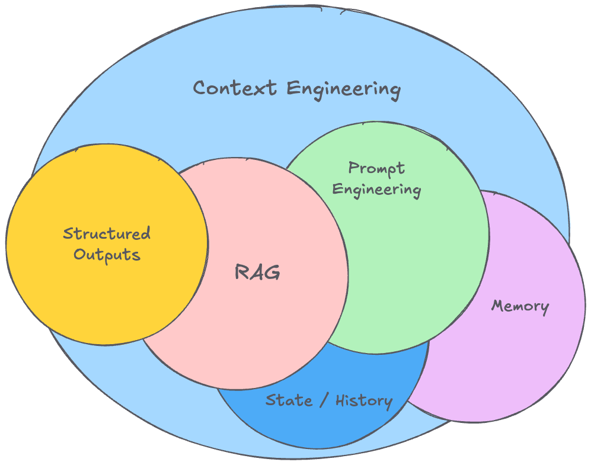

# Context Engineering: A Nova Fronteira da IA Agentiva

A arte de fornecer contexto relevante para os AI Agents no formato e na hora certa.

**Context Engineering** é a evolução natural do prompt engineering, focada na otimização de todo o payload informacional fornecido aos modelos de linguagem durante a inferência[^1]. Vai muito além de escrever bons prompts - é sobre arquitetar o contexto completo que permite aos agentes executarem tarefas complexas com autonomia e precisão.

## 🚀 Por que Context Engineering?

Até alguns anos atrás, muitos pesquisadores de IA (incluindo os mais renomados) afirmavam que o prompt engineering seria "coisa do passado". Obviamente, estavam muito enganados!

Na verdade, o prompt engineering se tornou ainda mais importante - tão importante que agora está sendo "rebatizado" como **context engineering**.

## 🎯 Context Engineering vs. Prompt Engineering

Enquanto o **prompt engineering** foca em escrever bons prompts estáticos, o **context engineering** engloba um escopo muito maior:

| **Prompt Engineering** | **Context Engineering** |
|---|---|
| "O que você diz" | "Tudo o mais que o modelo vê" |
| Instrução única | Exemplos, memória, retrieval, tools, estado, fluxo de controle |
| Prompts estáticos | Contexto dinâmico e adaptativo |
| Foco na pergunta | Foco na experiência completa |

### Os Pilares do Context Engineering

- **🔧 Montagem dinâmica** de contexto relevante de múltiplas fontes
- **⚡ Seleção adaptativa** de ferramentas e informações
- **📐 Formatação otimizada** para diferentes tipos de tarefa  
- **🧠 Gestão de memória** e estado do agente
- **🔍 Validação e filtragem** de informação ruidosa
- **⚖️ Balanceamento de recursos** e custos

!!! quote "O Contexto é Tudo"
    "Não é apenas o prompt único que os usuários enviam para um LLM. Contexto é o payload completo de informações fornecido a um LLM no momento da inferência"

---

[^1]: [The rise of "context engineering" - LangChain](https://blog.langchain.com/the-rise-of-context-engineering/)
