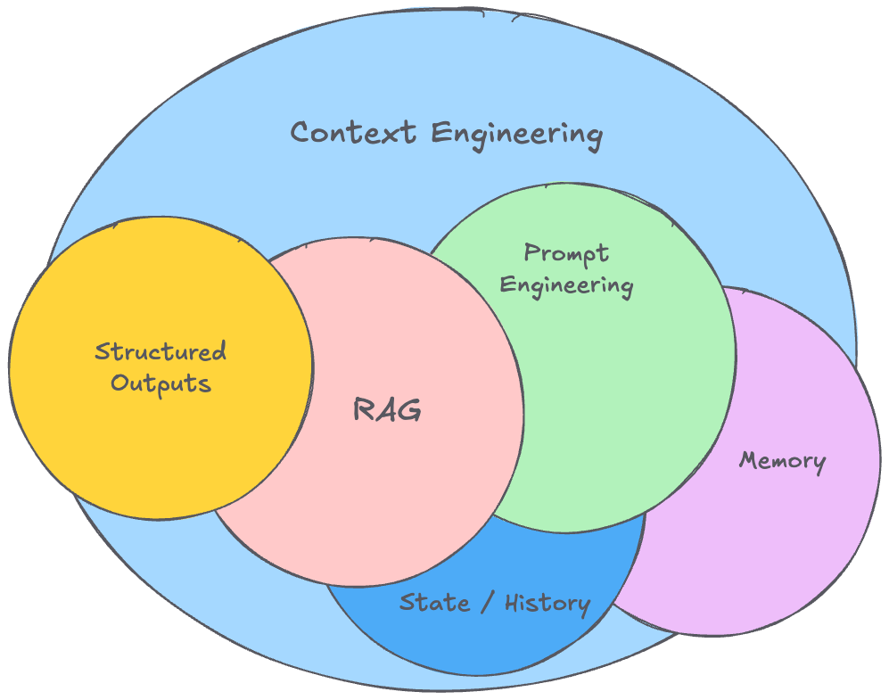

# Context Engineering

> "Context engineering is the delicate art and science of filling the context window with just the right information for the next step." — **[Andrej Karpathy](https://karpathy.ai/)**.

**Context Engineering** é o processo de construir sistemas dinâmicos que fornecem as informações e ferramentas certas no formato adequado, de modo que um modelo de linguagem (LLM) possa realizar uma tarefa de forma confiável[^1].

{ width="600px" loading=lazy }

É uma evolução natural de Prompt Engineering.

Enquanto Prompt Engineering foca em encontrar as palavras certas para o **System Prompt**, Context Engineering responde à pergunta mais ampla:[^2].

> "Qual configuração de contexto tem maior probabilidade de gerar o comportamento desejado do modelo?"

{ loading=lazy }
/// caption
[Effective context engineering for AI agents | Anthropic](https://www.anthropic.com/engineering/effective-context-engineering-for-ai-agents)
///

---

[^1]: [The rise of "context engineering" - LangChain](https://blog.langchain.com/the-rise-of-context-engineering/)
[^2]: [Effective context engineering for AI agents - Anthropic](https://www.anthropic.com/engineering/effective-context-engineering-for-ai-agents)
