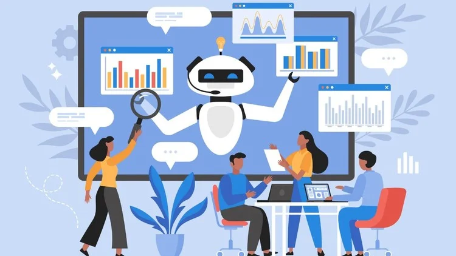

# Bem-vindo ao Agentic AI Workshop! 🤗

Neste workshop, vamos explorar a **Agentic AI**, uma nova abordagem em inteligência artificial que se baseia na capacidade de agentes computacionais agirem com autonomia para atingir objetivos específicos, sem depender de comandos manuais e com pouca ou nenhuma supervisão humana.

Você aprenderá a criar **AI Agents** (também conhecido como *LLM-based Agents*) e **AI Workflows** que podem raciocinar, planejar e executar ações de forma autônoma.

## O que vamos aprender?

### Dia 1 - 📚 Fundamentos Teóricos

- **Generative AI**: Modelos que criam conteúdo "novo" como texto, imagens, código, etc.
- **Agentic AI**: Diferenciação entre workflows e agentes, padrões eficazes e quando usar cada abordagem.
- **AI Agents 101**: Memória, RAG, gerenciamento de estado, ferramentas e Model Context Protocol (MCP).
- **AI Frameworks**: LangGraph, LlamaIndex, SmolAgents, Pydantic AI e outros.
- **AI Providers**: OpenAI, Google Gemini, Anthropic, Hugging Face e outros.
- **Observability**: MLflow Tracing, Langfuse, Langtrace e Pydantic Logfire

### Dia 2 - 🛠️ Hands-on Prático

- **Setup do Ambiente**: Configuração completa do ambiente de desenvolvimento
- **Projeto Prático**: Construção de um sistema completo de análise de RH
- **Implementação de Agentes**: Criação de agentes especializados para diferentes tarefas
- **RAG e Ferramentas**: Integração de bases de conhecimento e APIs externas
- **Observabilidade**: Monitoramento e debugging de sistemas agentivos
- **Deploy e Produção**: Estratégias para colocar agentes em produção

## Feedback

Valorizamos seu feedback! Ao final do workshop, você receberá um formulário para compartilhar suas opiniões e sugestões.

Contribuições são bem-vindas! Abra um *issue* ou *pull request* no [**repositório do workshop**](https://github.com/DougTrajano/agentic-ai-workshop/).
